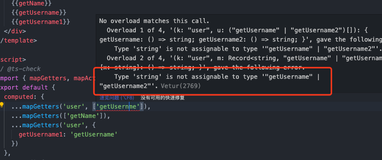

# vuex-ts-enhance

enhance types from vuex 

it will check `mapXXXX()` params for `state`, `getters`, `actions` in store

## Example

[state](./dev/store.ts)

**check for typescript**


**check for return type**


**tips from vscode**


## Usage

use `EnhanceStore` to create `store`

```ts
import { EnhanceStore } from 'vuex-ts-enhance'
import Vuex from 'vuex';
import Vue from 'vue';
Vue.use(Vuex);

// state cannot be declared
const state = {
  // your state
}
const s = new EnhanceStore(state);
export const { mapGetters, store, mapActions } = s;

```

```html
<template>
  <div>
    {{getName}}
    {{getUsername}}
    {{getUsername1}}
  </div>
</template>

<script>
// @ts-check
import { mapGetters, mapActions } from './store'
export default {
  computed: {
    ...mapGetters('namespace', ['namespaceGetter']), // will check type
    ...mapGetters(['getter1']),
    ...mapGetters('namespace', {
      getterAlias: 'namespaceGetter'
    })
  },
  mounted() {
    console.log(this.namespaceGetter)
    console.log(this.getter1)
    console.log(this.getterAlias)
    this.namespaceAction
    this.action1
  },
  methods: {
    ...mapActions('namespace', ['namespaceAction']),
    ...mapActions(['action1'])
  }
}
</script>
```

**Note**
if write in js and your `getter` or `actions` is empty, you must to declare it

```js
// store.js
/**
 * @constant
 * @type {import('vuex').GetterTree}
 */
const getters = {};
/**
 * @constant
 * @type {import('vuex').ActionTree}
 */
const actions = {
};
/**
 * @constant
 * @type {import('vuex').MutationTree}
 */
const mutations = {
};
```

## Notice

- You can't defined `state` as `StoreOptions`

```typescript
const state: StoreOptions<any> = {} // don't do that
```

- You must be defined `context` as `any` if use `jsdoc` for types

```javascript
const state = {
  actions: {
    /**
     * @param {any} context
     * @param {string} payload
     */
    someActions(context, payload) {}
  }
}
```

## develop

- `git clone project`
- `yarn dev`
- edit dev files
